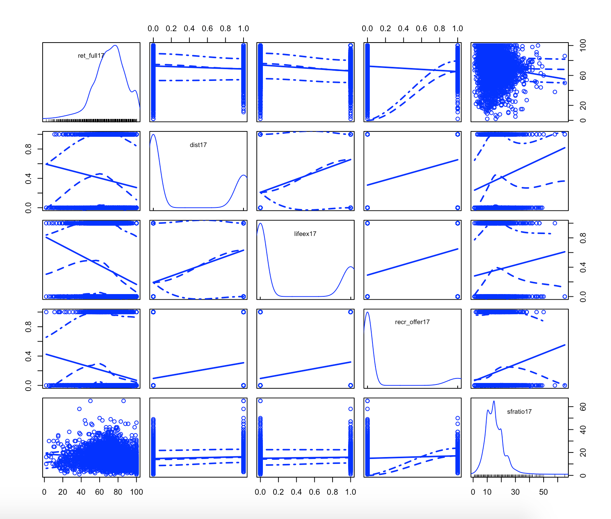

```{r setup, include=FALSE}
knitr::opts_chunk$set(echo = TRUE, tidy.opts = list(width.cutoff = 50), 
                      tidy = TRUE, fig.pos = 'H')

library(tidyverse)
library(car)
library(arm)
library(MCMCglmm)
library(lattice)
library(knitr)
library(formatR)
library(gridExtra)
```

# Why Model Retention Rates?

Retention rates are one of the most commonly used measures of an educational institution’s success in preparing its students for their careers, and a high retention rate is a badge of honor that institutions tend to strive for. However, an institution’s retention rate is a product of not only the institution’s accessibility to students, but also external factors that impact students—thus, retention rate as a standalone metric may not be very informative about an institution’s educational efficacy. I used data from the Integrated Postsecondary Education System Data System (IPEDS) in order to construct multilevel Binomial models of retention rates based on several institutional characteristics and offerings. Because these models only consider predictors on the institutional level and includes no predictors about institutions’ student bodies, they are not intended to—and in fact are not able to—paint a complete picture of the factors that impact retention rates. Instead, the models serve to pinpoint how several helpful educational features within institutions may relate to retention rates across the US, but also to demonstrate that it can be misleading to portray institutional success metrics as a direct product of an institution's efforts, due to the inevitable extra-curricular influences that can be confounded with such educational features. 

The data used in these models consisted of institutions in IPEDS records that had retention rate and public/private status information (public, private for-profit, private not-for-profit) available from 2017. All variables used were collected in 2017, which was the most recent year for which all variables of interest were available on the IPEDS data portal. I chose to use distance learning options, recreational options, and life experience credit as predictors because they are offerings that are presumably implemented with the purpose of making college a more welcoming place: distance learning makes educational attainment more accessible to those who may be working or may have difficulty physically attending a class; credit for life experiences acknowledges that accreditable learning opportunities do not all occur within the classroom ^[IPEDS defines “credit for life experiences” as “Credit earned by students for what they have learned through independent study, noncredit adult courses, work experience, portfolio demonstration, previous licensure or certification, or completion of other learning opportunities (military, government, or professional)".]; recreational options allow students to take a break from traditional academics while still learning new skills. Additionally, a lower student-faculty ratio may make it easier for students to get individualized attention from faculty, which can make the educational experience feel more personalized. 

``` {r include = FALSE}
edu <- read.csv('Data_11-11-2019---187.csv')

colnames(edu) <- c(  
  'id', 'name', 
  'ret_part17', 'ret_full17', 'sfratio17',
  'ret_part16', 'ret_full16', 'sfratio16', 
  'ret_part15', 'ret_full15', 'sfratio15',  
  'ret_part14', 'ret_full14', 'sfratio14',
  'acad_offer18', 'recr_offer18', 'lifeex18', 'dualcred18', 'tuitvary18', 'dist18',  
  'acad_offer17', 'recr_offer17', 'tuitvary17', 'lifeex17', 'dualcred17', 'dist17', 
  'acad_offer16', 'recr_offer16', 'tuitvary16', 'lifeex16', 'dualcred16',  
  'acad_offer15', 'recr_offer15', 'tuitvary15', 'lifeex15', 'dualcred15',  
  'acad_offer14', 'recr_offer14', 'lifeex14', 'dualcred14',  
  'acad_offer13', 'recr_offer13', 'lifeex13', 'dualcred13',  
  'ret_part13', 'ret_full13', 'sfratio13',  
  'acad_offer12', 'recr_offer12', 'lifeex12', 'dualcred12',  
  'ret_part12', 'ret_full12', 'sfratio12',  
  'acad_offer11', 'recr_offer11', 'lifeex11', 'dualcred11', 
  'ret_part11', 'ret_full11', 'sfratio11', 
  'acad_offer10', 'recr_offer10', 'lifeex10', 'dualcred10',  
  'ret_part10', 'ret_full10', 'sfratio10', 
  'acad_offer09', 'recr_offer09', 'lifeex09', 'dualcred09',  
  'state', 'highest_lvl',
  'gradrate_bach17', 'gradrate_bach16', 'gradrate_bach15', 
  'nonres17', 'nonres16', 'nonres15', 'nonres14', 'nonres13', 'nonres12', 'nonres11', 'nonres10',  
  'total17', 'total16', 'total15', 'total14', 'total13', 'total12', 'total11', 'total10', 'total09', 
  'tuit_priv_fp17', 'tuit_priv_nfp17', 'tuit_pub17', 
  'total_ft17',  
  'X' 
)

#### data cleaning / EDA ####
# make variable for public/private
edu$pubpriv <- apply(edu, MARGIN = 1, FUN = function (x) {
  if (!is.na(x['tuit_priv_fp17'])) {
    return('priv_fp')
  }
  else if (!is.na(x['tuit_priv_nfp17'])) {
    return('priv_nfp')
  }
  else if (!is.na(x['tuit_pub17'])) {
    return('pub')
  }
  else return(NA)
})

# make variable for tuition
for (i in 1:nrow(edu)) {
  if (!is.na(edu$tuit_priv_fp17[i])) {
    edu$tuit17[i] <- edu$tuit_priv_fp17[i]
  } 
  else if (!is.na(edu$tuit_priv_nfp17[i])) {
    edu$tuit17[i] <- edu$tuit_priv_nfp17[i]
  } 
  else if (!is.na(edu$tuit_pub17[i])) {
    edu$tuit17[i] <- edu$tuit_pub17[i]
  }
  else edu$tuit17[i] <- NA
}

edu17 <- dplyr::select(edu, id, name, state, pubpriv, highest_lvl, lifeex17, ret_full17, sfratio17, tuitvary17, acad_offer17, recr_offer17, dist17, gradrate_bach17, nonres17, total17, total_ft17, tuit17)

eduna <- is.na(edu17) %>% as.data.frame  # df for missing vars

# exclude those without pub/priv info (5386)
edu_17 <- edu17[!is.na(edu17$tuit17),] 
edu_17 <- edu_17[!is.na(edu_17$dist17) & !is.na(edu_17$lifeex17) & !is.na(edu_17$recr_offer17) & 
                   !is.na(edu_17$sfratio17) & !is.na(edu_17$pubpriv),]  # ones that are not missing the vars in question (5385)
```

``` {r include = FALSE}
# which(edu_17$state == '')
```

``` {r include = FALSE}
{
  edu_17$state[55] <- 'CA'
  edu_17$state[56] <- 'FL'
  edu_17$state[63] <- 'MD'
  edu_17$state[68] <- 'MA'
  edu_17$state[154] <- 'OK'  
  edu_17$state[155] <- 'OK'
  edu_17$state[209] <- 'PA'
  edu_17$state[433] <- 'MA'  
  edu_17$state[440] <- NA  
  edu_17$state[1031] <- 'OH'
  edu_17$state[1074] <- 'CA'  
  edu_17$state[1210] <- 'PA'
  edu_17$state[1244] <- 'VA'
  edu_17$state[1650] <- 'FL'
  edu_17$state[1876] <- 'GA'
  edu_17$state[1890] <- 'OH'   
  edu_17$state[1900] <- 'CO'
  edu_17$state[1901] <- NA  
  edu_17$state[1928] <- 'NE'
  edu_17$state[1979] <- 'MO'
  edu_17$state[1982] <- 'AZ'
  edu_17$state[1984] <- 'CA'
  edu_17$state[2206] <- 'PR'  
  edu_17$state[2551] <- 'MA'
  edu_17$state[2555] <- 'MA'
  edu_17$state[2629] <- 'TX'  
  edu_17$state[2746] <- 'HI'
  edu_17$state[2747] <- 'FL'
  edu_17$state[2748] <- 'FL'
  edu_17$state[2984] <- 'IL' 
  edu_17$state[2993] <- 'MA'
  edu_17$state[3266] <- 'TN'
  edu_17$state[3342] <- 'NE'
  edu_17$state[3351] <- 'PA'
  edu_17$state[3365] <- 'FL'  
  edu_17$state[3673] <- 'WA'
  edu_17$state[3741] <- 'CA'
  edu_17$state[3785] <- 'CT'
  edu_17$state[3786] <- 'NY'
  edu_17$state[3839] <- 'OR' 
  edu_17$state[4233] <- 'MO'
  edu_17$state[4255] <- 'NJ'
  edu_17$state[4328] <- 'WA'
  edu_17$state[4581] <- 'CA'  
  edu_17$state[5218] <- 'TN'
  edu_17$state[5330] <- 'PA'
  edu_17$state[5331] <- 'FL'
  edu_17$state[5368] <- 'NY'
}

edu_17 <- edu_17[!is.na(edu_17$state),]  # 5383
```

``` {r include = FALSE}
# print(nrow(edu_17))
```

``` {r include = FALSE}
#### making new vars ####
# centered sfratio, for easier interpretation
edu_17$sfratio_c <- edu_17$sfratio17 - mean(edu_17$sfratio17)  # ftr, mean is 15.268

# integer retention counts
edu_17$retcount <- round(edu_17$ret_full17 * edu_17$total_ft17 / 100)  # make column for number of retained
edu_17$notret <- edu_17$total_ft17 - edu_17$retcount  # and for number of not retained
```

# Models

Using this cleaned and narrowed data set, I fit two Binomial regression models with increasingly complex hierarchical structure. The student-faculty ratio variable was centered at its mean, which was 15.268, in order to improve interpretability. Because a Laplacian fitting algorithm produced nearly unidentifiable parameter estimates ^[Results from the Laplacian approach are detailed in Appendix B.], I used a Bayesian fitting approach, which allowed for more nuanced evaluation of the parameters’ convergence and permitted probabilistic statements about the parameters’ true values given the data.

## Model A: Multilevel model with varying intercepts per state and public/private status

Using a Markov Chain Monte Carlo algorithm, I fit a multilevel binomial model with varying intercepts for state and for public/private status. A multilevel structure was appropriate because it would account for the expected correlation of retention rates between institutions within the same state or within the same public/private status. A binomial regression was appropriate because each institution’s retention rate reflects a group of individuals, each of whom were retained or not retained—thus, each institution’s retention rate can be viewed as a binomial random variable. The institutional characteristics previously mentioned were used as the model’s non-varying predictors. The prior for this model was only specified with respect to the residual variance and the covariance structure of the varying intercepts. For all of those parameters, I supplied a weakly informative Inverse Chi-Square prior with a scale parameter of 1 and 2 degrees of freedom, which can be expressed as an Inverse Gamma distribution with a shape parameter of 1 and a scale parameter of 1 ^[Gelman, A. (2006). Prior distributions for variance parameters in hierarchical models (comment on article by Browne and Draper). Bayesian Analysis, 1(3), 515–534. doi: 10.1214/06-ba117a]. The model was fit with 40,000 iterations, with a burn-in period of 10,000 and a thinning factor of 30. 

``` {r echo = FALSE}
set.seed(60)
prior_inf <- list(
  R = list(V = 1, nu = 2),
  G = list(G1 = list(V = 1, nu = 2),
           G2 = list(V = 1, nu = 2)))
ipeds_mcmc2 <- MCMCglmm(cbind(retcount, notret) ~ dist17 + lifeex17 + recr_offer17 + sfratio_c,
                        ~ us(1):state +
                          us(1):pubpriv,
                        data = edu_17, family = 'multinomial2',
                        prior = prior_inf,
                        nitt = 40000, thin = 30, burnin = 10000, pr = T, verbose = F)
```

According to Model A ^[Full model outputs can be found in Appendix B.]:  

* A baseline institution that has no distance learning options, offers no credit for life experiences, offers no recreational or avocational opportunities, and has a typical student-faculty ratio of about 15 is expected to have a log odds retention rate ratio ^[The log odds retention rate ratio is the natural logarithm of the ratio between retention rate and its complement, attrition rate.] of `r summary(ipeds_mcmc2$Sol)$statistics[1, 1] %>% round(3)`, meaning that the estimated retention rate of such an institution would be 
$logit^{-1}$ (`r {summary(ipeds_mcmc2$Sol)$statistics[1, 1] %>% round(3)}`) = `r (invlogit(summary(ipeds_mcmc2$Sol)$statistics[1, 1])) %>% round(3)`.
* An institution that offers distance learning options is expected to have a log odds retention rate ratio that is `r summary(ipeds_mcmc2$Sol)$statistics[2, 1] %>% round(3) %>% abs` less than that of an institution that does not offer distance learning options, given that credit for life experiences, recreational offerings, and student faculty ratio are held constant. While the corresponding change in retention rate itself can vary depending on the original retention rate, an estimated upper bound on the corresponding change in retention rate is `r summary(ipeds_mcmc2$Sol)$statistics[2, 1] %>% round(3)` / 4 = `r (summary(ipeds_mcmc2$Sol)$statistics[2, 1] / 4) %>% round(3)`.
* An institution that offers credit for life experiences is expected to have a log odds retention rate ratio that is `r summary(ipeds_mcmc2$Sol)$statistics[3, 1] %>% round(3) %>% abs` less than that of an institution that does not offer credit for life experiences, given that distance learning offerings, recreational offerings, and student faculty ratio are held constant. While the corresponding change in retention rate itself can vary depending on the original retention rate, an estimated upper bound on the corresponding change in retention rate is `r summary(ipeds_mcmc2$Sol)$statistics[3, 1] %>% round(3)` / 4 = `r (summary(ipeds_mcmc2$Sol)$statistics[3, 1] / 4) %>% round(3)`.
* An institution that offers recreational or avocational opportunities is expected to have a log odds retention rate ratio that is `r summary(ipeds_mcmc2$Sol)$statistics[4, 1] %>% round(3) %>% abs` less than that of an institution that does not offer recreational or avocational opportunities, given that distance learning offerings, credit for life experiences, and student faculty ratio are held constant. While the corresponding change in retention rate itself can vary depending on the original retention rate, an estimated upper bound on the corresponding change in retention rate is `r summary(ipeds_mcmc2$Sol)$statistics[4, 1] %>% round(3)` / 4 = `r (summary(ipeds_mcmc2$Sol)$statistics[4, 1] / 4) %>% round(3)`.
* A unit increase in student-faculty ratio is generally associated with a decrease of `r summary(ipeds_mcmc2$Sol)$statistics[5, 1] %>% round(3) %>% abs` in the log odds ratio of retention rate, given that distance learning offerings, credit for life experiences, and recreational offerings are held constant. While the corresponding change in retention rate itself can vary depending on the original retention rate, an estimated upper bound on the corresponding change in retention rate is `r summary(ipeds_mcmc2$Sol)$statistics[5, 1] %>% round(3)` / 4 = `r (summary(ipeds_mcmc2$Sol)$statistics[5, 1] / 4) %>% round(3)`.

The estimate for the variance between states’ baseline retention rates, `r summary(ipeds_mcmc2)$Gcovariances[1,1] %>% round(3)`, was small compared to the estimate for the variance between public/private statuses’ baseline retention rates, `r summary(ipeds_mcmc2)$Gcovariances[2,1] %>% round(3)`. This discrepancy suggested that the state grouping may not provide much additional information about the baseline retention rate after the overall baseline retention rate is already considered. However, there seems to be much more variation in retention rates between public, private not-for-profit, and private for-profit institutions.  

Based on the estimated varying intercepts for public, private not-for-profit, and private for-profit institutions, a baseline institution that has no distance learning options, offers no credit for life experiences, offers no recreational or avocational opportunities, and has a typical student-faculty ratio is expected to have a retention rate of:  

* $logit^{-1}$ (`r {summary(ipeds_mcmc2$Sol)$statistics[1, 1] %>% round(3)}` - `r summary(ipeds_mcmc2$Sol)$statistics[64,1] %>% abs %>% round(3)`) = `r invlogit(summary(ipeds_mcmc2$Sol)$statistics[1, 1] + summary(ipeds_mcmc2$Sol)$statistics[64,1] ) %>% round(3)` if it is private for-profit
* $logit^{-1}$ (`r {summary(ipeds_mcmc2$Sol)$statistics[1, 1] %>% round(3)}` + `r summary(ipeds_mcmc2$Sol)$statistics[65,1] %>% abs %>% round(3)`) = `r invlogit(summary(ipeds_mcmc2$Sol)$statistics[1, 1] + summary(ipeds_mcmc2$Sol)$statistics[65,1] ) %>% round(3)` if it is private not-for-profit
* $logit^{-1}$ (`r {summary(ipeds_mcmc2$Sol)$statistics[1, 1] %>% round(3)}` - `r summary(ipeds_mcmc2$Sol)$statistics[66,1] %>% abs %>% round(3)`) = `r invlogit(summary(ipeds_mcmc2$Sol)$statistics[1, 1] + summary(ipeds_mcmc2$Sol)$statistics[66,1] ) %>% round(3)` if it is public

The variation in estimated baseline retention rate between the different public/private statuses remind us that the type of institution alone may be associated with factors that influence a student’s likelihood to stay in school, regardless of efforts made by the institution to prevent attrition. However, we must note that the standard deviation of these estimates all suggest 95% credible intervals that contain 0, so there is a great degree of uncertainty of these varying intercepts.  

## Model B: Multilevel model with varying intercepts per state and public/private status, and varying slope for recreational experiences per public/private status

I next fit a model similar to Model A, but with two major departures: 1.) it eliminated the distance learning predictor since the predictor did not seem very informative in Model A due to collinearity, and 2.) it allowed the slope for recreational offerings to vary across each public/private status. The addition of this random slope reflects the possibility that recreational offerings could have a different relationship with retention rate for public institutions than for private institutions, due to differences in the students that may attend each type of institution.  

``` {r echo = FALSE}
set.seed(60)
prior_inf2 <- list(
  R = list(V = 1, nu = 2),  
  G = list(G1 = list(V = 1, nu = 2),  
           G1 = list(V = diag(2), nu = 2)))  
ipeds_mcmc3 <-  MCMCglmm(cbind(retcount, notret) ~ lifeex17 + recr_offer17 + sfratio_c,
                         ~ us(1):state +
                           us(1 + recr_offer17):pubpriv,  
                         data = edu_17, family = 'multinomial2',
                         prior = prior_inf2,
                         nitt = 40000, thin = 30, burnin = 10000, pr = T, verbose = F) 
```

According to Model B ^[Full model outputs can be found in Appendix B.]:  

* A baseline institution that offers no credit for life experiences, offers no recreational or avocational opportunities, and has a typical student-faculty ratio of about 15 is expected to have a log odds retention rate ratio of `r summary(ipeds_mcmc3$Sol)$statistics[1, 1] %>% round(3)`, meaning that the estimated retention rate of such an institution would be $logit^{-1}$ (`r summary(ipeds_mcmc3$Sol)$statistics[1, 1] %>% round(3)`) = `r invlogit(summary(ipeds_mcmc3$Sol)$statistics[1, 1]) %>% round(3)`.
* An institution that offers credit for life experiences is expected to have a log odds retention rate ratio that is `r summary(ipeds_mcmc3$Sol)$statistics[2, 1] %>% round(3) %>% abs` less than that of an institution that does not offer credit for life experiences, given that recreational offerings and student faculty ratio are held constant. While the corresponding change in retention rate itself can vary depending on the original retention rate, an estimated upper bound on the corresponding change in retention rate is `r summary(ipeds_mcmc3$Sol)$statistics[2, 1] %>% round(3)` / 4 = `r (summary(ipeds_mcmc3$Sol)$statistics[2, 1] / 4)  %>% round(3)`.
* An institution that offers recreational or avocational opportunities is expected to have a log odds retention rate ratio that is `r summary(ipeds_mcmc3$Sol)$statistics[3, 1] %>% round(3) %>% abs` less than that of an institution that does not offer recreational or avocational opportunities, given that credit for life experiences and student faculty ratio are held constant. While the corresponding change in retention rate itself can vary depending on the original retention rate, an estimated upper bound on the corresponding change in retention rate is `r summary(ipeds_mcmc3$Sol)$statistics[3, 1] %>% round(3)` / 4 = `r (summary(ipeds_mcmc3$Sol)$statistics[3, 1] / 4) %>% round(3)`.
* A unit increase in student-faculty ratio is generally associated with a decrease of `r summary(ipeds_mcmc3$Sol)$statistics[4, 1] %>% round(3) %>% abs` in the log odds ratio of retention rate, given that distance learning offerings, credit for life experiences, and recreational offerings are held constant. While the corresponding change in retention rate itself can vary depending on the original retention rate, an estimated upper bound on the corresponding change in retention rate is `r summary(ipeds_mcmc3$Sol)$statistics[4, 1] %>% round(3)` / 4 = `r (summary(ipeds_mcmc3$Sol)$statistics[4, 1] / 4) %>% round(3)`.

Despite the change in model structure, the predictors’ coefficients remain fairly similar—in both direction and magnitude—to their corresponding coefficients in Model A. However, the p-value of recreational offerings, which was close to 0 in Model A, is now very high. Allowing the coefficient of recreational offerings to vary by public/private status may have introduced more uncertainty into the overall coefficient estimate.  

The estimate for the variance between states’ baseline retention rates, `r summary(ipeds_mcmc3)$Gcovariances[1,1] %>% round(3)`, was again small compared to the estimate for the variance between public/private statuses’ baseline retention rates, `r summary(ipeds_mcmc3)$Gcovariances[2,1] %>% round(3)`. This again suggested that the state grouping may not provide much additional information about the baseline retention rate after the overall baseline retention rate is already considered. However, there seems to be relatively much more variation in retention rates between public, private not-for-profit, and private for-profit institutions. It is important to note the uncertainty about the variance between public/private statuses’ baseline retention rates: the confidence interval about the mean estimate is very wide on the upper limit because the spread of the distribution is so wide that the estimates are truncated at 0 on the lower limit. This is likely because there are only three public/private status groups from which this parameter is estimated. A similar lack of precision is observed with the estimated variance between public/private statuses’ slopes for recreational offerings.  

Based on the estimated varying intercepts for public, private not-for-profit, and private for-profit instutions, a baseline institution that has no distance learning options, offers no credit for life experiences, offers no recreational or avocational opportunities, and has a typical student-faculty ratio is expected to have a retention rate of:

* $logit^{-1}$ (`r {summary(ipeds_mcmc3$Sol)$statistics[1, 1] %>% round(3)}` - `r summary(ipeds_mcmc3$Sol)$statistics[63,1] %>% abs %>% round(3)`) = `r invlogit(summary(ipeds_mcmc3$Sol)$statistics[1, 1] + summary(ipeds_mcmc3$Sol)$statistics[63,1] ) %>% round(3)` if it is private for-profit
* $logit^{-1}$ (`r {summary(ipeds_mcmc3$Sol)$statistics[1, 1] %>% round(3)}` + `r summary(ipeds_mcmc3$Sol)$statistics[64,1] %>% abs %>% round(3)`) = `r invlogit(summary(ipeds_mcmc3$Sol)$statistics[1, 1] + summary(ipeds_mcmc3$Sol)$statistics[64,1] ) %>% round(3)` if it is private not-for-profit
* $logit^{-1}$ (`r {summary(ipeds_mcmc3$Sol)$statistics[1, 1] %>% round(3)}` - `r summary(ipeds_mcmc3$Sol)$statistics[65,1] %>% abs %>% round(3)`) = `r invlogit(summary(ipeds_mcmc3$Sol)$statistics[1, 1] + summary(ipeds_mcmc3$Sol)$statistics[65,1] ) %>% round(3)` if it is public

This echoes the pattern seen in Model A’s intercepts across public/private statuses: private not-for-profit institutions are expected to have higher baseline retention rates than private for-profit and public institutions. However, similarly to in Model A, all of these estimates’ 95% credible intervals contain 0, so we can not be very sure of their precision.  

Based on the estimated varying recreational offering slopes for public, private not-for-profit, and private for-profit institutions, an institution that offers recreational or avocational opportunities is expected to have a log odds retention rate ratio that is:  

* `r summary(ipeds_mcmc3$Sol)$statistics[3, 1] %>% round(3)` - `r summary(ipeds_mcmc3$Sol)$statistics[66,1] %>% abs %>% round(3)` = `r (summary(ipeds_mcmc3$Sol)$statistics[3, 1] + summary(ipeds_mcmc3$Sol)$statistics[66,1]) %>% abs %>% round(3)` lower than an institution that does not offer recreational or avocational opportunities, given that credit for life experiences and student faculty ratio are held constant, for for-profit institutions. An estimated upper bound on the corresponding change in retention rate is `r (summary(ipeds_mcmc3$Sol)$statistics[3, 1] + summary(ipeds_mcmc3$Sol)$statistics[66,1]) %>% round(3)` / 4 = `r ((summary(ipeds_mcmc3$Sol)$statistics[3, 1] + summary(ipeds_mcmc3$Sol)$statistics[66,1]) / 4) %>% round(3)`.
* `r summary(ipeds_mcmc3$Sol)$statistics[3, 1] %>% round(3)` + `r summary(ipeds_mcmc3$Sol)$statistics[67,1] %>% abs %>% round(3)` = `r (summary(ipeds_mcmc3$Sol)$statistics[3, 1] + summary(ipeds_mcmc3$Sol)$statistics[67,1]) %>% abs %>% round(3)` higher than an institution that does not offer recreational or avocational opportunities, given that credit for life experiences and student faculty ratio are held constant, for private not-for-profit institutions. An estimated upper bound on the corresponding change in retention rate is `r (summary(ipeds_mcmc3$Sol)$statistics[3, 1] + summary(ipeds_mcmc3$Sol)$statistics[67,1]) %>% round(3)` / 4 = `r ((summary(ipeds_mcmc3$Sol)$statistics[3, 1] + summary(ipeds_mcmc3$Sol)$statistics[67,1]) / 4) %>% round(3)`.
* `r summary(ipeds_mcmc3$Sol)$statistics[3, 1] %>% round(3)` - `r summary(ipeds_mcmc3$Sol)$statistics[68,1] %>% abs %>% round(3)` = `r (summary(ipeds_mcmc3$Sol)$statistics[3, 1] + summary(ipeds_mcmc3$Sol)$statistics[68,1]) %>% abs %>% round(3)` lower than an institution that does not offer recreational or avocational opportunities, given that credit for life experiences and student faculty ratio are held constant, for public institutions. An estimated upper bound on the corresponding change in retention rate is `r (summary(ipeds_mcmc3$Sol)$statistics[3, 1] + summary(ipeds_mcmc3$Sol)$statistics[68,1]) %>% round(3)` / 4 = `r ((summary(ipeds_mcmc3$Sol)$statistics[3, 1] + summary(ipeds_mcmc3$Sol)$statistics[68,1]) / 4) %>% round(3)`.  

Interestingly, the varying slopes suggest that the presence of recreational opportunities is associated with higher retention rates in private not-for-profit institutions, yet is associated with lower retention rates in private for-profit and public institutions. Again, this cannot necessarily be interpreted as a causal effect on retention rates—the competition between institutional factors and external student-specific factors may vary between each of these types of institutions. Additionally, the standard deviation of these estimates all suggest 95% credible intervals that contain 0, so there remains much uncertainty about these varying intercepts. With these results in mind, private and public institutions may find it useful to investigate, on the student level, how the quality and variety of recreational programs contribute to the educational experience, or whether participation in these programs are relevant or feasible to students in the first place. For instance, students who work part time to sustain their families, who may be a more prominent subpopulation in public institutions than private not-for-profit institutions, may not have as much time to take advantage of recreational options and may also be more at risk for dropping out. 

# Model Checking   

## Model A  

In order to check the stability of the MCMC coefficient estimates, I first inspect the trace plots (Figure 1) for stationarity and compare the posterior sample densities (Figure 2) to a Normal distribution. The QQ plots for the posterior sample densities (Figure 3) suggest that aside from the intercept, the coefficient estimates across the fitting iterations are roughly normally distributed. The QQ plot for the intercept, however, suggests that the distribution has heavier tails than a Normal distribution despite its symmetry, which places more weight on the extreme values of the posterior distribution and makes the posterior mean relatively less probable. The trace plots for all of these coefficient estimates appear stationary aside from occasional outliers, which suggests that the estimated posterior distributions are stable.

``` {r echo = FALSE, fig.cap = 'Trace Plots for Model A Non-Varying Coefficients'}
# 1
xyplot(as.mcmc(ipeds_mcmc2$Sol[,5:1]))
```

``` {r echo = FALSE, fig.cap = 'Density Plots for Model A Non-Varying Coefficients'}
# 2
densityplot(as.mcmc(ipeds_mcmc2$Sol[,5:1]))
```

``` {r echo = FALSE, fig.cap = c('QQ Plots for Model A Non-Varying Coefficients')}
# 3
par(mfrow = c(2, 3))
qqnorm(ipeds_mcmc2$Sol[,1], main = 'Intercept'); qqline(ipeds_mcmc2$Sol[,1]) 
qqnorm(ipeds_mcmc2$Sol[,2], main = 'Distance Learning'); qqline(ipeds_mcmc2$Sol[,2]) 
qqnorm(ipeds_mcmc2$Sol[,3], main = 'Credit for Life Experiences'); qqline(ipeds_mcmc2$Sol[,3]) 
qqnorm(ipeds_mcmc2$Sol[,4], main = 'Recreational Offerings'); qqline(ipeds_mcmc2$Sol[,4])  
qqnorm(ipeds_mcmc2$Sol[,5], main = 'Student-Faculty Ratio'); qqline(ipeds_mcmc2$Sol[,5]) 
```

Next, I compare Model A’s parameter estimates to the unstable estimates from a Laplacian model ^[More details about the Laplacian model can be found in Appendix B.] fitted with the lmer package, which has the same model structure. In this model, convergence is determined by the algorithm, unlike with the MCMC modeling framework. Upon fitting the model, this warning message appears: "Model is nearly unidentifiable: large eigenvalue ratio". This indicates that the model fitting algorithm had trouble converging, due to some combination of the model structure and the data.

Laplacian model coefficients:
``` {r echo = FALSE, warning = FALSE}
ipeds2 <- glmer(cbind(retcount, notret) ~ dist17 + lifeex17 + recr_offer17 + sfratio_c + (1 | state) + (1 | pubpriv), family = binomial, data = edu_17)

summary(ipeds2)$coef
```

\newpage

MCMC model coefficients:
``` {r echo = FALSE}
summary(ipeds_mcmc2)$solutions
```

The most obvious difference is that the coefficient for distance learning offerings has a very small p-value and a much larger positive magnitude in the Laplacian model, whereas the MCMC model has a very large p-value and a negative magnitude closer to 0. The sample density of Model A’s iterations suggests that the distance learning coefficient estimate from the analogous Laplacian model, `r summary(ipeds2)$coef[2,1] %>% round(3)`, is plausible but extremely unlikely. The intercepts between the two models appear to be consistent with one another. The other coefficients, while similar in direction and magnitude, are all of slightly larger magnitude in the Laplacian model, and most of the Laplacian model’s coefficients fall outside of the 95% credible intervals produced from the MCMC model. The similarity between most of these parameter estimates affirms Model A’s plausibility. Given our knowledge of the collinearity of the three binary predictors, Model A provides a more appropriately conservative suggestion that distance learning may not have an effect on retention rate once the other predictors have been accounted for. 

``` {r echo = FALSE, fig.cap = 'Trace Plots for Model A Varying Intercept Variances'}
# 4
xyplot(as.mcmc(ipeds_mcmc2$VCV[,2:1]))
```

``` {r echo = FALSE, fig.cap = 'Density Plots for Model A Varying Intercept Variances'}
# 5
densityplot(as.mcmc(ipeds_mcmc2$VCV[,2:1]))
```

The trace plot and density plot for the variance between state-specific intercepts (Figures 4 and 5) suggest that the posterior for the variance estimate is convergent. Based on the narrow spread of the posterior, it is highly credible that the between-state variance is a positive value near 0. However, the variance of intercepts between the public/private statuses (Figure 4) has a spread that is harshly truncated at 0, so while the posterior mean of these intercepts’ variance is higher than the posterior mean of the between-state variance, there is much more uncertainty about this estimate, and it is plausible that the true variance between the public/private statuses’ intercepts is 0. The trace plots for both of these parameters reveal rough stationarity aside from occasional spikes.

## Model B

The QQ plot for the overall intercept’s posterior (Figure 8) again reveals heavy tails, which makes its posterior mean relatively less credible than that from a roughly Normal distribution. The QQ plot for the coefficient of recreational offerings (Figure 8) also shows that the tails of the sample posterior are heavier than that of a Normal distribution, which may be a complication of the newly added varying slopes for this variable. This kurtosis compounds the preexisting uncertainty about the recreational offerings coefficient suggested with the drastic increase in its p-value compared to Model A. The remaining QQ plots (Figure 8) for the other coefficients show that the corresponding posterior densities (Figure 7) are roughly Normal, and all trace plots (Figure 6) show stationarity aside from occasional outliers, which suggests that these estimates are stable. The coefficient estimates are roughly consistent with those of Model A, aside from the obviously eliminated term for distance learning.

``` {r echo = FALSE, fig.cap = 'Trace Plots for Model B Non-Varying Coefficients'}
# 6
xyplot(as.mcmc(ipeds_mcmc3$Sol[,4:1]))
```

``` {r echo = FALSE, fig.cap = 'Density Plots for Model B Non-Varying Coefficients'}
# 7
densityplot(as.mcmc(ipeds_mcmc3$Sol[,4:1]))
```

``` {r echo = FALSE, fig.cap = c('QQ Plots for Model B Non-Varying Coefficients')}
# 8
par(mfrow = c(2, 3))
qqnorm(ipeds_mcmc3$Sol[,1], main = 'Intercept'); qqline(ipeds_mcmc3$Sol[,1]) 
qqnorm(ipeds_mcmc3$Sol[,2], main = 'Credit for Life Experiences'); qqline(ipeds_mcmc3$Sol[,2]) 
qqnorm(ipeds_mcmc3$Sol[,3], main = 'Recreational Offerings'); qqline(ipeds_mcmc3$Sol[,3])  
qqnorm(ipeds_mcmc3$Sol[,4], main = 'Student-Faculty Ratio'); qqline(ipeds_mcmc3$Sol[,4]) 
```

The density plot of the estimated variation between the state-specific intercepts (Figure 10), with its small spread, again allows for high credibility that the between-state variance is a small, positive, and close to 0. The density plot of the estimated variation for the intercept between different public/private statuses (Figure 10) has a wide spread that get sharply truncated at 0; thus, it is still likely that the true variation of intercepts between public/private statuses is 0, despite the posterior mean being greater than 1. Finally, the density plot of the estimated variation between recreational offerings slopes per public/private status (Figure 10) reveals a very large spread, and the distribution is also sharply truncated at 0, suggesting major uncertainty about this estimate. Despite this uncertainty, the trace plots for all of these parameters (Figure 9) reveal rough stationarity aside from several outliers.


``` {r echo = FALSE, fig.cap = 'Trace Plots for Model B Varying Intercept Variances'}
# 9
xyplot(as.mcmc(ipeds_mcmc3$VCV[,c(5, 2, 1)]))
```

``` {r echo = FALSE, fig.cap = 'Density Plots for Model B Varying Intercept Variances'}
# 10
densityplot(as.mcmc(ipeds_mcmc3$VCV[,c(5, 2, 1)]))
```

\newpage

# Discussion

Fitting the models with the MCMC framework allowed for more probabilistic assessments about the convergence and stability, which cannot be made from a frequentist framework. Therefore, although a Laplacian model fit was nearly unidentifiable, the same model under an MCMC fit could still be deemed valid based on the characteristics of the algorithm’s trace over time and the shape of the resulting estimated posterior distribution. Including two non-nested grouping variables in the multilevel model, however, made the model more difficult to fit—increasingly so when adding a varying intercept on top of the varying slopes. However, a Bayesian framework made it easier to visually pinpoint the credibility of the posterior means for both the coefficient estimates and the between-group variances, as well as to confirm whether the MCMC sampling process was yielding adequately consistent results.  

The hierarchical structure of Model A and B assumes a common distribution behind the intercepts corresponding to different states, and a common distribution behind the intercepts corresponding to different public/private statuses. Due to this characteristic of the models, the main coefficients represent trends that fit the entire set of institutions in general, and the coefficients are moderated by further information about an institution’s state and public/private status. Both Model A and Model B denote that offering credit for life experiences, offering recreational/avocational options, and having a higher student-faculty ratio are all associated with lower retention rates. Both models identify credit for life experiences and recreational offerings as the predictors that are associated with the largest expected change in retention rate, whereas distance learning and student-faculty ratio contribute more marginally to the retention rate. Student-faculty ratio has a negative association with retention rate, which is consistent with the common intuition that more individualized attention contributes to a more encouraging academic setting. Yet the three binary predictors in the model, all of which represent features that are intended to make the postsecondary education experience more welcoming or accommodating, are all negatively associated with lower retention probabilities, which at first instinct may seem counterintuitive. However, these associations may actually reflect the complex push and pull between external barriers to educational attainment and institutions’ efforts to compensate for these barriers. It is possible that an institution with a lower retention rate may actually be doing better in creating an accessible learning environment than its higher-retention-rate counterparts, perhaps because its student body’s particular struggles inspired such efforts in the first place. Contrarily, it is also possible that the quality of such efforts genuinely have some sort of negative impact on retention rates.  

The varying intercepts for public/private statuses suggest that private not-for-profit institutions are generally expected to have higher retention rates than private for-profit or public institutions. Additionally, the varying slopes reveal that recreational and avocational resources may have completely different roles in the educational experience for private not-for-profit vs. private for-profit and public institutions. When allowing the recreational offerings slope to vary for each public/private status, however, the estimate of the overall recreational offerings coefficient becomes much more uncertain, suggesting that the relationship between recreational offerings and retention rate is dominated by the difference between that variable’s three groups. However, the model is unable to provide enough precision on the public/private status groups’ varying intercepts or slopes to confidently claim that they differ.

Although these models identify overarching relationships between retention rates and several institutional features believed to improve or facilitate the educational experience, the causality behind these relationships remains unknown. Additionally, the precision of the parameter estimates are limited by the data, which is already a very substantial fraction of the entire population of postsecondary institutions throughout the nation. The limitations of these models, and the questions that remain after understanding their results, can inspire institutions’ future efforts to investigate specifically into the bidirectional causal forces between their own offerings and their retention rates. By starting conversations based on the model results, institutions can evaluate where they individually fit into the picture painted by the models, and use these conversations to improve their programs in accordance with their community’s needs. For instance, an institution could obtain much more valuable data for these purposes by administering surveys or hosting student forums about how their resources are addressing student needs. Such measures may include questions about the degree of influence of personal, physical, or social factors on students’ ability/desire to take advantage of certain resources, or overall evaluations of how welcome students feel taking advantage of certain resources. These measures would allow for a better understanding of confounding variables that also impact retention rates. Additionally, collecting more standardized information from these causal survey measures across institutions nationwide could help fit an improved model that identifies trends between students’ relationships with institutional resources and retention rates, rather than the resources themselves and retention rates. Without considering such factors that exist outside an institution’s responsibility or control, however, a retention rate can be a very noisy, uninformative metric of an institution’s quality or appeal.

\newpage

# Appendix A: Data Set Selection and Cleaning

When first selecting data on the IPEDS data portal, I selected all institutions with retention rate information, since retention rate would serve as the model’s outcome variable. Out of the 5,575 institutions with retention rate information, 189 were missing information on the institution’s public/private status. Since I intended to use public/private status as a grouping variable in the multilevel models, I had to assess whether the missing public/private status data points were missing at random with respect to either the response or the predictors of interest before excluding them from the model—if they were not missing at random, there is evidence that the data could be biased. To do this, I first produced jitter plots to visually detect any dependence between public/private status missingness and each variable. If a plot appeared to demonstrate dependence, I ran a logistic regression of public/private status missingness on the variable and assessed the resultant coefficient and the magnitude of its t-value.

Based on this analysis, public/private status appeared to be missing at random with respect to most variables of interest. However, the jitter plot pertaining to recreational offerings (Figure 11) suggested that institutions with no recreational offerings were more likely to be missing public/private status info; therefore, the data used to fit the models may not be fully representative of institutions without recreational offerings.

\newpage

``` {r, echo = FALSE, fig.cap = 'Plot of Missing Public/Private Status Data vs. Recreational Offerings in Raw Data'}
ggplot(data = NULL, aes(x = edu$recr_offer17, y = eduna$tuit17)) + geom_jitter(alpha = 0.07, stroke = 0, size = 2) + xlab('Offers Recreational Options') + ylab('Is Missing Public/Private Status Data')

glm(eduna$tuit17 ~ edu$recr_offer17, family = binomial) %>% summary  # **** large negative effect (more tuition info missing for schools with no recr offerings). 
```

It is important to note that the aforementioned analysis only included institutions where public/private status was missing but the other variable of interest was not. Since there were institutions missing both public/private status information and the other variables of interest, and since these institutions could be fundamentally different from those that are not missing the variables of interest, many excluded institutions may not be missing at random, and the final data set could still be a biased representation of postsecondary institutions in 2017 with respect to those variables. The models in this report are simply fitted under the assumption that this bias does not exist.

48 of the institutions with retention rate information for 2017 were missing information on the state in which they were located. Because locational information is easier to identify and locate than public/private status, and because there were not too many missing data points, I manually researched and imputed this data. Upon looking up these institutions, I noticed that most if not all of them had closed sometime between 2017 and now. However, since my model is based on data from institutions that were open at the time that the data was collected, excluding these institutions may bias the model. The majority of them were beauty or vocational schools. Two of the 48 institutions missing state information had names and data that were too vague to definitively verify their location through online information, so I decide to exclude these two institutions.

Finally, one institution was missing student-faculty ratio information, and a consistent value for their student-faculty ratio could not be found through online sources, so I excluded this institution as well.

Using the remaining 5,383 entries, I constructed a scatterplot matrix (Figure 12) and correlation matrix with the variables of interest. These matrices suggested that the three binary predictors that I intended to use in the retention rate model—distance learning offerings, credit for life experiences, and recreational offerings—were positively correlated, and thus collinearity could become an issue in the modeling process.

``` {r echo = FALSE}
cor(edu_17 %>% dplyr::select(ret_full17, dist17, lifeex17, recr_offer17, sfratio17))
```
  

# Appendix B: Model Details

## Laplacian Model (fit with lmer)

Initially, I attempted to fit a multilevel binomial model for retention rate using the lme4 package in R, which uses Laplacian approximation to retrieve parameter estimates. This model had the same structure as Model A:

``` {r echo = FALSE}
summary(ipeds2)
```

This model was nearly unidentifiable, which indicated that the coefficient estimates were highly unstable and could not be trusted. Scaling the predictors or removing correlated predictors did not aid in convergence. As can be expected, adding random slopes for either of the grouping variables also led to a non-convergent model.  Given this outcome, I decided to shift to a Bayesian framework in order to provide prior information on the within-group and between-group variances, and to be able to make a more informed judgment on the model’s convergence. 

## Model A Outputs  

Variable Key:  
dist17 = Offers Distance Learning  
lifeex17 = Offers Credit for Life Experience   
recr_offer17 = Offers Recreational/Avocational Opportunities  
sfratio_c = Student-Faculty Ratio, Centered at Mean  
priv_fp = Private Not-for-Profit  
priv_nfp = Private For-Profit  
pub = Public  

``` {r eval = FALSE}
set.seed(60)
prior_inf <- list(
  R = list(V = 1, nu = 2),
  G = list(G1 = list(V = 1, nu = 2),
           G2 = list(V = 1, nu = 2)))
ipeds_mcmc2 <- MCMCglmm(cbind(retcount, notret) ~ dist17 + lifeex17 + recr_offer17 + sfratio_c,
                        ~ us(1):state +
                          us(1):pubpriv,
                        data = edu_17, family = 'multinomial2',
                        prior = prior_inf,
                        nitt = 40000, thin = 30, burnin = 10000, pr = T, verbose = F)
```

``` {r echo = FALSE}
summary(ipeds_mcmc2$Sol)
summary(ipeds_mcmc2)$Gcovariances
```

## Model B Outputs  

Variable Key:  
lifeex17 = Offers Credit for Life Experience   
recr_offer17 = Offers Recreational/Avocational Opportunities  
sfratio_c = Student-Faculty Ratio, Centered at Mean  
priv_fp = Private Not-for-Profit  
priv_nfp = Private For-Profit  
pub = Public  

``` {r eval = FALSE}
set.seed(60)
prior_inf2 <- list(
  R = list(V = 1, nu = 2),  
  G = list(G1 = list(V = 1, nu = 2),  
           G1 = list(V = diag(2), nu = 2)))  
ipeds_mcmc3 <-  MCMCglmm(cbind(retcount, notret) ~ lifeex17 + recr_offer17 + sfratio_c,
                         ~ us(1):state +
                           us(1 + recr_offer17):pubpriv,  
                         data = edu_17, family = 'multinomial2',
                         prior = prior_inf2,
                         nitt = 40000, thin = 30, burnin = 10000, pr = T, verbose = F) 
```

``` {r echo = FALSE}
summary(ipeds_mcmc3$Sol)
summary(ipeds_mcmc3)$Gcovariances
```